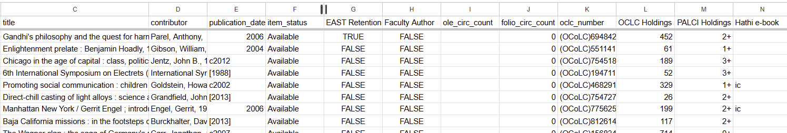
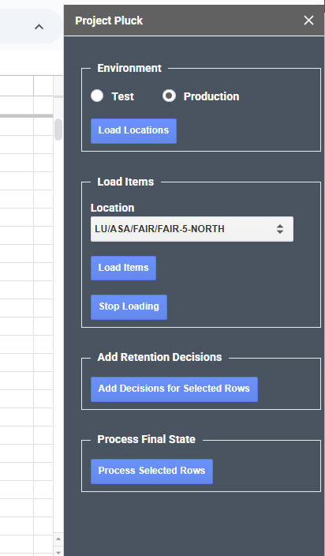
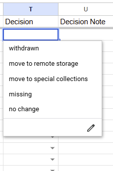

# Project Pluck

A Google Sheets-based application that aggregates item data from several sources to support collection management decisions.

> In the Fall of 2024 Lehigh University Libraries started a collection weeding plan that was dubbed “Project Pluck”. The idea behind Project Pluck was to create a process to help librarians carefully maintain the vitality and health of the physical collection by assessing and recording decisions concerning retention and withdrawal of physical materials. Because a project like this crosses library domains a committee was formed to assess the needs of each of the library teams. That committee designed a workflow that attempted to address the many scenarios that arise. The committee also wanted a process that could be used on a yearly basis, throughout our libraries. <br><br>
Armed with that information, Lehigh designed and built a tool around these specifications that guides library staff throughout the process. The tool consolidates relevant data for each bibliographic record from FOLIO, WorldCat, and HathiTrust APIs into Google Sheets spreadsheets where the potential withdrawals can be reviewed, and decisions made.  Using this tool has centralized and streamlined workflows, increased accuracy, and writes informative data points to FOLIO that will assist with future retention decisions.

## FOLIO, OCLC WorldCat and HathiTrust Data Points



The following data points are loaded into each spreadsheet tab, for all of the items in a given location.

From FOLIO:
- Barcode
- Effective call number
- Title
- Contributor
- Publication date
- Item status
- Circulation count
- Holdings record permanent location
- Instance UUID
- Instance HRID
- Pre-FOLIO circulation count
    - Or any item note type
- EAST Retention statistical code present?
    - Or any item statistical code
- Faculty Author item note text present?
    - Or any item note text

From OCLC WorldCat:
- Total holdings count
- Holdings count within a consortium
    - Where consortium is any defined list of OCLC codes
    - Approximate value, since the API doesn't support this function directly.

From HathiTrust:
- Rights code(s) if available

## Workflow


Assuming one-time setup (below) is complete.

1. Create a new tab (sheet) on the Google Sheets spreadsheet.
1. Click Project Pluck > Show Sidebar.
1. Select an environment and click Load Locations.
1. Select a FOLIO item location and click Load Items.
    1. The sheet will populate with the FOLIO items in that location, enriched with WorldCat and HathiTrust data.
1. Make decisions on each item:
    1. Select a retention decision into the Decision column.
    1. Optionally enter a Decision Note as well.
1. Select the rows and click Add Decisions for Selected Rows.
1. After final checks, select the rows again and click Process Final State > Process Selected Rows.


### Decisions

Decisions and optional notes for each item are stored in FOLIO.




## Initial Setup and Configuration

### Google Apps Script

1. Create a Google Sheets spreadsheet.
1. Install the .js and .html files into the spreadsheet as a [container-bound script](https://developers.google.com/apps-script/guides/bound).  Two options:
    1. Click Extensions > Apps Script and create each file manually by copy/paste.
    1. Use [Clasp](https://developers.google.com/apps-script/guides/clasp) to upload the code to your spreadsheet.  Requires npm.
1. Add [folio-apps-script-authentication](https://github.com/lehigh-university-libraries/folio-apps-script-authentication/blob/main/Code.js)'s Code.js.
    1. Rename it to Auth.js.
    1. Edit the BASE_OKAPI and BASE_FOLIO paths at the top.
1. Enable "Show appsscript.json manifest file in editor" en the Apps Script settings.
1. Edit appsscript.json to include these scopes
    ```
    "oauthScopes": [
        "https://www.googleapis.com/auth/spreadsheets.currentonly",
        "https://www.googleapis.com/auth/script.container.ui",
        "https://www.googleapis.com/auth/script.scriptapp",
        "https://www.googleapis.com/auth/script.external_request",
        "https://www.googleapis.com/auth/script.send_mail",
        "https://www.googleapis.com/auth/userinfo.email"
    ],
    ```
1. Under Libraries, add
    1. [OAuth2](https://github.com/googleworkspace/apps-script-oauth2): 1B7FSrk5Zi6L1rSxxTDgDEUsPzlukDsi4KGuTMorsTQHhGBzBkMun4iDF
1. Add several Script Properties in the Apps Script settings:
    1. `username` and `password`: FOLIO credentials to a user account with these permissions:
        ```
        Circulation log: View
        Inventory: View, create, edit holdings
        Inventory: View, create, edit instances
        Inventory: View, create, edit items
        (you also need permission to view [edit is not required] statistical codes, item note types, and instance statuses)
        ```
    1. `oclcId` and `oclcSecret`: [API "WSkey"](https://www.oclc.org/developer/api/keys.en.html) to use the OCLC [WorldCat Search API v.2](https://developer.api.oclc.org/wcv2).
    1. `uptimeRobotApiKey`, `uptimeRobotHeartbeatKey`, `uptimeRobotMonitorId`: [UptimeRobot](https://uptimerobot.com/) monitoring for when the script fails and can't be automatically restarted, so you can do so manually.

### FOLIO

Create the specified FOLIO inventory settings, customizing as needed:

1. Create statistical codes in FOLIO used to indicate a keep or withdraw decision.
    1. Configure these in Code.js (see "// Final States")
1. Create the appropriate statistical codes for any retention agreements, and set the list of IDs here.
    1. Configure these in Code.js (see "// Retention Statistical Codes")
1. Create an item note type to store the decision.
    1. Configure this in Code.js (see "// Decision Note" in Code.js)
1. Configure the list of possible decisions in Code.js (see "// Decisions")
1. Configure the LEGACY_CIRC_COUNT_NOTE_TYPE_ID in Code.js to an item note type that stores pre-FOLIO circulation counts.
1. Configure OCLC_NUMBER_IDENTIFIER_TYPE_ID in Code.js to the identifier type's UUID.  Identifier types are listed in Settings > Inventory > Resource identifier types, and the UUID can be determined via developer tools (or an API call).

### OCLC

1. Configure the PALCI_OCLC_SYMBOLS list of symbols in Oclc.js.  The application determines consortium (PALCI) membership by looking for these specific institution codes present in the list of holdings institutions returned by the OCLC API.


## More Information

See the (upcoming) [WOLFcon 2025](https://wolfcon2025.sched.com/) presentation about this process.
