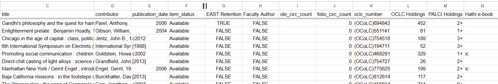
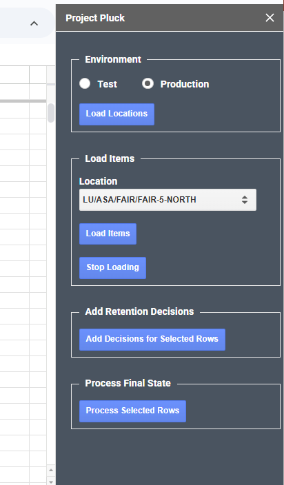
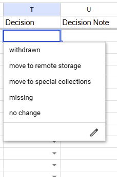

# Project Pluck

A Google Sheets-based application that aggregates item data from several sources to support collection management decisions.

> In the Fall of 2024 Lehigh University Libraries started a collection weeding plan that was dubbed "Project Pluck". The idea behind Project Pluck was to create a process to help librarians carefully maintain the vitality and health of the physical collection by assessing and recording decisions concerning retention and withdrawal of physical materials. Because a project like this crosses library domains a committee was formed to assess the needs of each of the library teams. That committee designed a workflow that attempted to address the many scenarios that arise. The committee also wanted a process that could be used on a yearly basis, throughout our libraries. <br><br>
Armed with that information, Lehigh designed and built a tool around these specifications that guides library staff throughout the process. The tool consolidates relevant data for each bibliographic record from FOLIO, WorldCat, and HathiTrust APIs into Google Sheets spreadsheets where the potential withdrawals can be reviewed, and decisions made.  Using this tool has centralized and streamlined workflows, increased accuracy, and writes informative data points to FOLIO that will assist with future retention decisions.

## WOLFcon 2025 Presentation

See the [WOLFcon 2025](https://wolfcon2025.sched.com/) recorded [presentation](https://www.youtube.com/watch?v=DuNw5IQ21Dc) about this process and tool.

[](https://www.youtube.com/watch?v=DuNw5IQ21Dc)

## FOLIO, OCLC WorldCat and HathiTrust Data Points



The following data points are loaded into each spreadsheet tab, for all of the items in a given location.

From FOLIO (item-level fields unless otherwise noted):
- Barcode
- Effective call number
- Title
- Contributor
- Publication date
- Status
- Circulation count
- Effective location
- Statistical codes presence
    - By default, checks for retention agreements and [inventory status](https://github.com/lehigh-university-libraries/folio-offline-shelf-reading)
- Note text
    - By default, checks for Faculty Author status, pre-FOLIO circulation count, and inventoried condition (damage) notes
- Holdings record permanent location
- Instance material type
- Instance UUID
- Instance HRID
- Linked works (Metadb mode only)
    - Electronic holdings records referencing this print instance — access method and provider

From OCLC WorldCat:
- Total holdings count, max 200 reported
- Holdings count within one or more consortia
    - Where consortium is any defined list of OCLC symbols
    - Approximate value, since the API doesn't support this function directly

From HathiTrust:
- Rights code(s) if available

All columns are optional and can be enabled or disabled per session via **Project Pluck > Select columns**.

## Loading Modes

The tool supports two modes for loading item data from FOLIO, selected via the `loadingMode` script property:

- **`folio` mode**: Loads items via direct FOLIO REST API calls. Works with any standard FOLIO installation. Loads an complete FOLIO location.
- **`metadb` mode**: Loads items from Metadb ([via a mod-reporting FOLIO API](https://s3.amazonaws.com/foliodocs/api/mod-reporting/p/ldp.html#ldp_db_reports_post)). Requires a Metadb instance. Significantly faster for large batches, and supports loading by an arbitrary call number range within a location.

## Workflow


Assuming one-time setup (below) is complete.

1. Create a new tab (sheet) on the Google Sheets spreadsheet.
1. Click **Project Pluck > Show Sidebar**.
1. Select an environment and click **Load Locations**.
1. Select a FOLIO item location.
    1. In Metadb mode: enter a start call number prefix (and optionally an end prefix; leave blank to load only that start prefix).
1. Click **Load Items**.
    1. The sheet will populate with the FOLIO items in that location, enriched with WorldCat and HathiTrust data.
    1. If auto-decision rules are configured and enabled, some Decision cells may be pre-filled.
1. Make decisions on each item:
    1. Select a retention decision in the Decision column.
    1. Optionally enter a Decision Note as well.
1. Select the rows and click **Add Decisions for Selected Rows**.
1. After final checks, select the rows again and click **Process Final State > Process Selected Rows**.

### Decisions

Decisions and optional notes for each item are stored in FOLIO.



### Auto-Decision Rules

The **Project Pluck > Configure auto-decision rules** menu item opens a dialog where rules can be enabled/disabled and their parameters tuned. Rules are evaluated for each item as it is loaded; the first matching rule sets the Decision and Decision Note automatically. All rules are off by default.

Built-in rules:
- **Retention agreement**: sets *No change* for items with a retention commitment
- **Low worldwide holdings**: sets *No change* for items with ≤ N OCLC holdings (default: 25)
- **High FOLIO circulation**: sets *No change* for items with ≥ N FOLIO circulation events (default: 1)
- **High pre-FOLIO circulation**: sets *No change* for items with ≥ N pre-FOLIO circulation count, based on an item note (default: 1)
- **Published after year**: sets *No change* for items published in or after year N (default: 2000)
- **Published before year**: sets *No change* for items published in or before year N (default: 1900)
- **Damage**: sets *Withdraw* for items with a damage note, optionally only when containing a specific substring
- **Electronic holdings**: sets *Withdraw* for (physical) items with equivalent electronic holdings, based on certain note data set on the electronic holdings records.

Each rule's target decision and numeric parameters are configurable in the dialog.

## Initial Setup and Configuration

The codebase is split into two Google Apps Script projects with different lifecycles:

- **`shared_library/`** — Core application logic, deployed **once per institution** as a reusable Apps Script library. Contains institution-specific configuration (FOLIO item note types, statistical codes, consortium symbols).
- **`instance/`** — A thin container-bound wrapper script, attached to a single Google Sheets spreadsheet. **One per librarian or weeding project** — each has its own column preferences, auto-decision rule settings, and credentials.

### Part A: Institution Setup (done once)

#### Option A1: Manual

1. Go to [script.google.com](https://script.google.com) and create a new standalone project titled "Project Pluck Library".
1. Note the script ID from the project URL.
1. Create each file from `shared_library/` (click **+** > Script or HTML file) and copy/paste the contents from this repository.
1. In **Project Settings**, enable "Show appsscript.json manifest file in editor" and replace its contents with the contents of `shared_library/appsscript.json`.
1. Go to **Deploy > New deployment > Library**. Note the deployment ID.
1. Click "Share this project with others" and add as viewers 

#### Option A2: Clasp (for developers)

Requires [Node.js](https://nodejs.org/) and npm. Useful if you want to track your own fork in git and push updates repeatably.

1. Clone this repository.
1. Install Clasp: `npm install -g @google/clasp`, then `clasp login`.
1. Deploy the shared library:
    ```
    cd shared_library
    clasp create --type standalone --title "Project Pluck Library"
    clasp push
    ```
    Note the script ID printed by `clasp create`.
1. In the Apps Script editor: **Deploy > New deployment > Library**.

#### Institution Configuration

Edit `shared_library/Config.js` to configure all institution-specific settings — FOLIO server URLs, tenant ID, item note types, statistical codes, decisions, and OCLC consortium symbol lists. Comments within that file explain each setting.

#### Metadb Setup (if using metadb mode)

The SQL functions are in the `metadb/` directory of this repository. **Do not reference the raw GitHub URLs from this repo directly** — any update pushed here would immediately affect your production instance. Instead, choose one of:

- **Fork this repository** and reference the raw URLs from your fork. Update on your own schedule.
- **Copy the SQL files** to a stable location you control (e.g. your own server or object storage) and reference those URLs.

Provide the resulting report URLs as script properties in Part B.

### Part B: Per-Project / Per-Librarian Setup

Each librarian or weeding project gets their own Google Sheets spreadsheet with the instance script attached.

#### Option B1: Template Spreadsheet

1. Make a copy of the [Project Pluck template spreadsheet](#) *(link TBD)*.
    - The bound instance script transfers automatically.
1. In the Apps Script editor for the spreadsheet: **Libraries > Add library** > paste your institution's shared library script ID > select the latest version > set identifier to `ProjectPluck`.
1. Open **Project Settings > Script Properties** and fill in your values (see table below).

#### Option B2: Clasp (for developers)

1. Create a Google Sheets spreadsheet and note its ID from the URL.
1. Deploy the instance script:
    ```
    cd instance
    clasp create --type sheets --title "Project Pluck" --parentId <spreadsheet-id>
    clasp push
    ```
1. In the Apps Script editor for the instance: **Libraries > Add library** > paste the shared library script ID from Part A > select the latest version > set identifier to `ProjectPluck`.
1. Set script properties (see table below).

#### Script Properties

| Property | Required | Notes |
|---|---|---|
| `loadingMode` | Yes | `'folio'` or `'metadb'` |
| `username` | Yes | FOLIO service account username |
| `password` | Yes | Base64-encoded FOLIO password (see note below) |
| `oclcId`, `oclcSecret` | Yes | OCLC [WorldCat Search API v2](https://developer.api.oclc.org/wcv2) credentials |
| `metadbUrlLoadItems` | Metadb mode | URL to the `get_items_between_call_number_prefixes` report endpoint |
| `metadbUrlValidateBoundaries` | Metadb mode | URL to the `validate_call_number_boundaries` report endpoint |
| `uptimeRobotApiKey`, `uptimeRobotHeartbeatKey`, `uptimeRobotMonitorId` | Optional | [UptimeRobot](https://uptimerobot.com/) monitoring; disabled automatically if any are absent |

> **Password encoding:** The password must be base64-encoded for obfuscation. Use the Linux `base64` utility (`echo "mypassword" | base64`) or a web tool such as [base64encode.org](https://www.base64encode.org/).

#### FOLIO Permissions

The FOLIO service account needs:
```
Circulation log: View
Inventory: View, create, edit holdings
Inventory: View, create, edit instances
Inventory: View, create, edit items
(view access to statistical codes, item note types, and instance statuses is also required)
```

#### Shared Library Permissions

Each librarian using a Project Pluck spreadsheet needs Google access permission to use the shared library.

1. Go to [script.google.com](https://script.google.com) and open the copy of the shared library you created above in Institution Setup.
1. Click "Share this project with others" and add the librarian, with Viewer permissions.

## Shelf Reading / Inventory

The [WOLFcon 2025 recorded presentation](https://www.youtube.com/watch?v=DuNw5IQ21Dc) above includes a "Lesson Learned" that we had to conduct a physical inventory before we could make reliable weeding decisions.  We built a separate [FOLIO Offline Shelf Reading](https://github.com/lehigh-university-libraries/folio-offline-shelf-reading) tool to support that inventory project. 

Some of the item fields displayed by Project Pluck are outputs of that inventory process:
- Inventory status
- Inventoried condition (damage) notes
